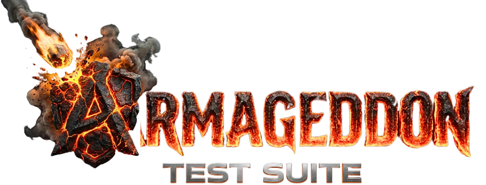
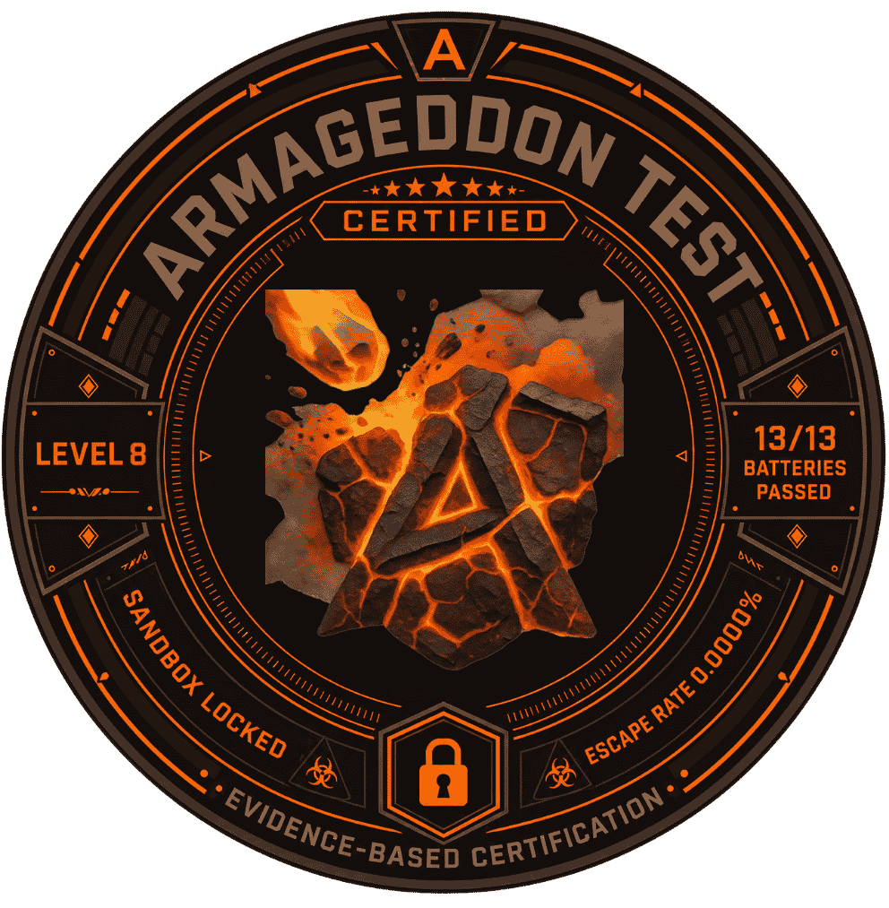

# <div align="center">ARMAGEDDON</div>

<div align="center">
  
  
</div>

<div align="center">
  <h3>ADVERSARIAL CERTIFICATION SUITE [LEVEL 8]</h3>
  <p>
    <b>CLASSIFICATION: APEX-INTERNAL</b> // <b>STATUS: ACTIVE</b> [MOAT_SECURE]
  </p>
  
  [](https://apexbusiness.systems)
  []()
  []()
</div>

---

## 📡 SYSTEM OVERVIEW

**Armageddon** is the ultimate adversarial testing engine designed to validate AI agent resilience. The **Level 8 "Kinetic Moat"** update introduces a self-contained, air-gapped compatible execution environment driven by a custom **Python Bridge**.

- **Proprietary Moat**: Docker-based containment field, fully decoupled from cloud providers.
- **Kinetic Engine**: Node.js/Python hybrid execution context for adversarial batteries.
- **Zero-Failure Tolerance**: Automated "Kill Switch" protocols.
- **Tamper-Evident Receipts**: Every certification report is Ed25519-signed with a SHA-256 Merkle audit tree (RFC 6962). Third parties verify offline with the shipped `verify.mjs` — zero dependencies. Public verification key is published at `/api/attestation/pubkey`.

## 🏗 ARCHITECTURE (PROPRIETARY)

The system runs as a localized "Moat" cluster defined in `docker-compose.moat.yml`.

```mermaid
graph TD
    User([User]) -->|Localhost:3000| UI[Containment Interface]

    subgraph "The Moat (Docker Network)"
        Worker[Armageddon Worker (Kinetic)]
        Temporal[Temporal Server]
        Postgres[(Persistence)]
    end

    UI -->|Dispatch| Temporal
    Temporal -->|Task Queue| Worker
    Worker -->|Python Bridge| Kinetic[Kinetic Python Engine]
```

## 🚀 DEPLOYMENT PROTOCOL

**Reference**: [`DEPLOYMENT.md`](./DEPLOYMENT.md) for full protocol.

### QUICK START (MOAT EDITION)

1.  **Configure Secrets**:

    ```powershell
    cp .env.moat.example .env.moat
    # Edit .env.moat with your keys
    ```

2.  **Ignite the Moat**:

    ```powershell
    .\scripts\deploy_moat.ps1
    ```

    _Builds, Verifies, and Deploys in one atomic operation._

3.  **Access**:
    - **UI**: http://localhost:3000
    - **Temporal**: http://localhost:8080

## 🛡️ SAFETY PROTOCOLS

> [!WARNING]
> **SIM_MODE MUST BE ENABLED AT ALL TIMES.**

### KILL SWITCH (SEV-1)

In case of containment breach:

```powershell
.\scripts\kill_moat.ps1
```

## 📂 DIRECTORY STRUCTURE

```
/
├── armageddon-site/      # [UI] Next.js Dashboard
├── packages/core/      # [ENGINE] Temporal Worker & Kinetic Python
├── scripts/              # [OPS] Moat Automation Checks
│   ├── deploy_moat.ps1   # Deployment Automator
│   ├── kill_moat.ps1     # Emergency Suppression
│   └── verify_kinetic... # Bridge Verification
└── docker-compose.moat.yml # Moat Orchestration
```


## ✅ CI QUALITY GATES (ROOT)

As of **2026-05-15 (docs version 2026.05.15)**, repository-root validation uses npm command entrypoints defined in `package.json`:

```bash
npm ci
npm run lint
npm run typecheck
npm run test
npm run build
```

These orchestrate deterministic workspace checks for `packages/shared`, `armageddon-core`, and `armageddon-site` through root `package.json` scripts. Do not document Bun/Yarn/pnpm commands unless the package-manager contract changes in `package.json`.

## 📚 DOCUMENTATION HUB

Start with [`docs/README.md`](./docs/README.md) before onboarding, changing deployment flows, or updating operational docs. The documentation hub defines canonical docs, historical records, and anti-drift rules for new contributors and agents.

## 📜 LICENSE

**CONFIDENTIAL**.
Source code, attack patterns, and testing methodologies are proprietary to **APEX Business Systems Ltd.**
Unauthorized reproduction or reverse engineering is strictly prohibited.

_Copyright © 2026 APEX Business Systems Ltd. All rights reserved._


## Legal & Authorized Use
See [ACCEPTABLE_USE.md](./ACCEPTABLE_USE.md).
