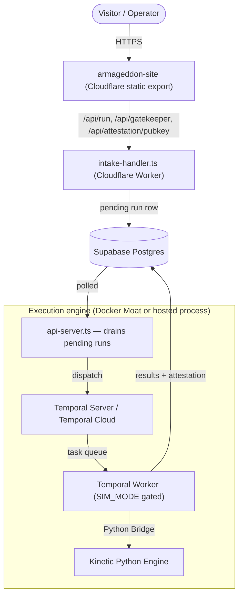

# <div align="center">ARMAGEDDON</div>

<div align="center">
  
  
</div>

<div align="center">
  <h3>ADVERSARIAL CERTIFICATION SUITE [LEVEL 8]</h3>
  <p>
    <b>CLASSIFICATION: APEX-INTERNAL</b> // <b>STATUS: ACTIVE</b> [MOAT_SECURE]
  </p>
  
  [](https://apexbusiness.systems)
  []()
  []()
</div>

---

## 📡 SYSTEM OVERVIEW

**Armageddon** is an adversarial testing engine that certifies AI agent/system resilience across **8 certification levels** (`packages/shared/src/levels.ts` is the single source of truth). Levels 1–6 run simulated adversaries in the cloud; **Level 7** ("God Mode") drives a real LLM adversary; **Level 8 "Kinetic Moat"** is Level 7 executed air-gapped, in Docker, with a tamper-evident signed receipt.

The product ships as **two coordinated surfaces**:

1. **Public control plane** (`armageddon-site/`) — a Next.js app deployed as a static export to Cloudflare Workers Assets (`armageddon-site/wrangler.jsonc`). It serves marketing, pricing, onboarding, and an authenticated `/console` workspace. The only dynamic backend reachable at the edge is the Cloudflare Worker in `armageddon-site/src/intake-handler.ts` (`/api/run`, `/api/gatekeeper`, `/api/me/organizations`, `/api/attestation/pubkey`, `/api/omniport/*`, support chat). Every action degrades honestly when a live backend isn't configured for a given deployment — it never fabricates a run, verdict, or certificate.
2. **Execution engine** (`packages/core/`) — a Node.js Temporal worker + API server that actually drains pending runs and executes adversarial batteries, optionally bridging into a Python engine. It can run locally via the Docker "Moat" (`docker-compose.moat.yml`) or against Temporal Cloud from a hosted process (`packages/core/src/api-server.ts`).

- **Tamper-Evident Receipts**: Every certification report is Ed25519-signed with a SHA-256 Merkle audit tree (RFC 6962). Third parties verify offline with the shipped `verify.mjs` — zero dependencies. The public verification key is served from `/api/attestation/pubkey` on the edge Worker (`handleAttestationPubkey` in `intake-handler.ts`).
- **Zero-Failure Tolerance**: `packages/core/src/worker.ts` refuses to start (`process.exit(1)`) unless `SIM_MODE=true` — a deliberate, non-bypassable safety gate. Live-fire (Level 7/8) execution is a separate, explicit deployment decision that has not been made in this repository as shipped; see `CLAUDE.md` Invariant 10.

## 🏗 ARCHITECTURE



## 🚀 DEPLOYMENT PROTOCOL

**Start here**: [`docs/README.md`](./docs/README.md) — the canonical documentation hub, with links to Cloudflare deployment, local Moat deployment, and operational runbooks.

**Reference**: [`DEPLOYMENT.md`](./DEPLOYMENT.md) for the local Moat protocol; [`docs/CLOUDFLARE_DEPLOYMENT.md`](./docs/CLOUDFLARE_DEPLOYMENT.md) for the public static-edge deployment.

### QUICK START (MOAT EDITION)

1.  **Configure Secrets**:

    ```powershell
    cp .env.moat.example .env.moat
    # Edit .env.moat with your keys
    ```

2.  **Ignite the Moat**:

    ```powershell
    .\scripts\deploy_moat.ps1
    ```

    _Builds, Verifies, and Deploys in one atomic operation._

3.  **Access**:
    - **UI**: http://localhost:3000
    - **Temporal**: http://localhost:8080

## 🛡️ SAFETY PROTOCOLS

> [!WARNING]
> **SIM_MODE MUST BE ENABLED AT ALL TIMES.**

### KILL SWITCH (SEV-1)

In case of containment breach:

```powershell
.\scripts\kill_moat.ps1
```

## 📂 DIRECTORY STRUCTURE

```
/
├── armageddon-site/        # [PUBLIC] Next.js site — marketing, onboarding, pricing,
│                           #   /console workspace, Cloudflare Worker (intake-handler.ts)
├── packages/core/          # [ENGINE] Temporal Worker, API server, Kinetic Python bridge
├── packages/shared/        # [SoT] Certification levels, gate logic, OmniPort primitives
├── scripts/                # [OPS] Moat/Cloudflare deploy, kill, verify, doc/level-integrity gates
│   ├── deploy_moat.ps1     # Local Moat deployment automator
│   ├── kill_moat.ps1       # Emergency suppression
│   └── build_cloudflare_static.mjs # Canonical static-export build (excludes src/app/api)
├── docs/                   # Documentation hub — start at docs/README.md
├── omni-recall/            # Durable agent memory / session audit trail
└── docker-compose.moat.yml # Local Moat orchestration
```


## ✅ CI QUALITY GATES (ROOT)

Repository-root validation uses npm command entrypoints defined in `package.json` (re-verified green 2026-07-22 — 447 tests passed across `packages/core` and `armageddon-site`, plus a full onboarding→console user-shoes browser validation):

```bash
npm ci
npm run lint
npm run typecheck
npm run test
npm run build
```

These orchestrate deterministic workspace checks for `packages/shared`, `armageddon-core` (`packages/core`), and `armageddon-site` through root `package.json` scripts. Do not document Bun/Yarn/pnpm commands unless the package-manager contract changes in `package.json`. The public Cloudflare static export is built separately via `node scripts/build_cloudflare_static.mjs` (see `docs/CLOUDFLARE_DEPLOYMENT.md`) — it is not part of the root `npm run build`.

## 📚 DOCUMENTATION HUB

Start with [`docs/README.md`](./docs/README.md) before onboarding, changing deployment flows, or updating operational docs. The documentation hub defines canonical docs, historical records, and anti-drift rules for new contributors and agents.

## 📜 LICENSE

**CONFIDENTIAL**.
Source code, attack patterns, and testing methodologies are proprietary to **APEX Business Systems Ltd.**
Unauthorized reproduction or reverse engineering is strictly prohibited.

_Copyright © 2026 APEX Business Systems Ltd. All rights reserved._


## Legal & Authorized Use
See [ACCEPTABLE_USE.md](./ACCEPTABLE_USE.md).
