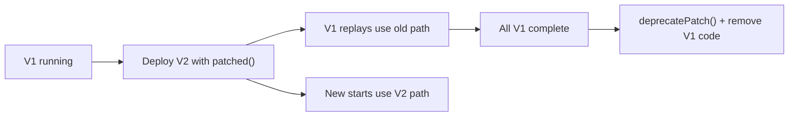

# Temporal Determinism & Python Bridge — Engineering Guide

> **CLASSIFICATION**: INTERNAL | **Product**: Armageddon Test Suite / Kinetic Moat

---

## The Determinism Rule

Temporal Workflows must be **deterministic**: given the same input history, replay must produce the same sequence of commands. Violations cause `NonDeterminismError` and halt the workflow.

### ❌ NEVER on a Workflow Thread

| Violation                        | Why                           | Fix                                                |
| -------------------------------- | ----------------------------- | -------------------------------------------------- |
| `Math.random()`                  | Different values on replay    | Use `workflow.uuid4()` or pass random via Activity |
| `Date.now()` / `new Date()`      | Clock differs on replay       | Use `workflow.now()` (server-side time)            |
| `fs.readFile()` / `fetch()`      | I/O may return different data | Move to an Activity                                |
| `setTimeout()` / `setInterval()` | Non-deterministic timers      | Use `workflow.sleep()` or `workflow.timer()`       |
| Network calls (HTTP, gRPC)       | External state changes        | Wrap in an Activity                                |
| `process.env` reads              | Env may differ across replays | Pass config as workflow input or use Activity      |

### ✅ ALWAYS Safe

| Pattern                         | Notes                         |
| ------------------------------- | ----------------------------- |
| `workflow.sleep(duration)`      | Deterministic timer           |
| `workflow.now()`                | Replay-safe timestamp         |
| `workflow.executeActivity(...)` | Side effects belong here      |
| `workflow.uuid4()`              | Deterministic UUID generation |
| Pure computation (no I/O)       | Always safe to replay         |

---

## Python Bridge Activities

The Armageddon worker delegates Python execution via Activities. Rules:

1. **Python calls are Activities** — all `subprocess.exec('python3 ...')` calls must be wrapped in a Temporal Activity, never called directly from workflow code.
2. **Idempotency** — Activities should be idempotent (re-runnable without side effects) since Temporal may retry on failure.
3. **Timeouts** — Every Activity must specify `startToCloseTimeout` and `scheduleToCloseTimeout`.

```typescript
// ✅ CORRECT: Python bridge as Activity
const pythonResult = await workflow.executeActivity(
  runPythonBridge,
  {
    script: "armageddon_verification.py",
    args: ["--battery", "B10"],
  },
  {
    startToCloseTimeout: "30s",
    retry: { maximumAttempts: 3 },
  },
);

// ❌ INCORRECT: Direct subprocess in workflow thread
// import { execSync } from 'child_process';
// const result = execSync('python3 armageddon_verification.py');
```

---

## Workflow Versioning Strategy

Use `WORKFLOW_VERSION` constants with Temporal's `patched()` API to evolve workflows safely without breaking in-flight executions.

### Pattern

```typescript
// src/workflows/armageddon-suite.ts

// Increment when changing workflow logic that affects replay
const WORKFLOW_VERSION = 2;

export async function armageddonSuiteWorkflow(
  input: SuiteInput,
): Promise<SuiteResult> {
  // Version gate: new logic only runs for new workflow starts
  if (workflow.patched("v2-battery-config")) {
    // V2: supports battery configuration
    const config = input.config ?? { batteries: ["B10"] };
    await workflow.executeActivity(runBattery, config);
  } else {
    // V1: legacy path (kept for in-flight workflow replay)
    await workflow.executeActivity(runBattery, { batteries: ["B10"] });
  }

  // After all V1 workflows complete, deprecate:
  // workflow.deprecatePatch('v2-battery-config');
}
```

### Version Migration Lifecycle



### Rules

1. **Never change existing workflow logic** — add a `patched()` gate instead.
2. **Never remove old code paths** until all in-flight workflows using that version have completed.
3. **Track versions** in a constant at the top of each workflow file.
4. **Document changes** in a `CHANGELOG.md` or inline comment per version bump.

---

**APEX Business Systems Ltd.** // _Omnipotence via Rigor_
