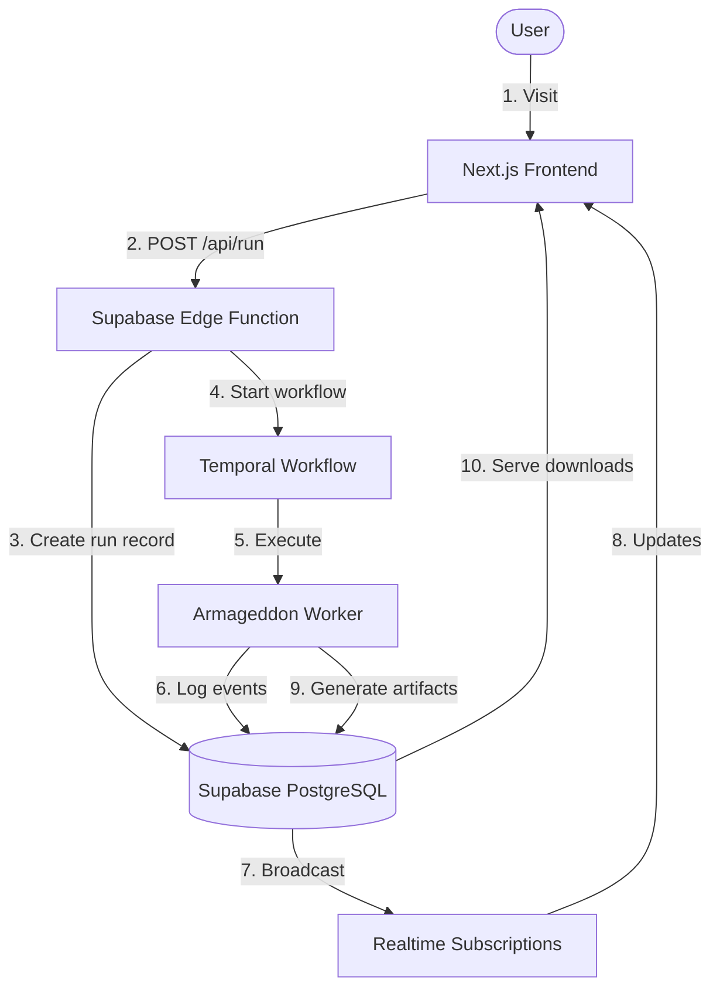

# Armageddon Test Suite — Complete Workflow Guide


---

## Phase 1: Onboarding

### Step 1.1: Account Creation

```
User → armageddon.apex.com → Sign Up
├─ Email + Password (traditional)
└─ GitHub OAuth (recommended)
```

### Step 1.2: Tier Selection

```
Choose Your Path:
├─ FREE (Simulation Mode)
│  ├─ 100 iterations max
│  ├─ Deterministic simulation
│  └─ Educational results
│
└─ CERTIFIED (Live Fire Mode)
   ├─ 10,000 iterations
   ├─ Real adversarial attacks
   └─ Production-grade validation
```

### Step 1.3: Repository Connection

```
Connect GitHub Repository
├─ OAuth grants read access
├─ Select target repo from dropdown
└─ Armageddon clones to ephemeral sandbox
```

---

## Phase 2: Test Configuration

### Step 2.1: Configure Run

```
Test Configuration Panel:
├─ Repository: [user-org/repo-name]
├─ Level: [1-7] (7 = God Mode)
├─ Iterations: [100 | 10,000]
└─ Target Model: [gpt-4-turbo | claude-3-opus]
```

### Step 2.2: Initiate Test

```
[RUN TEST] Button
↓
Frontend → POST /api/run
↓
Supabase creates armageddon_runs record
↓
Temporal workflow triggered
```

---

## Phase 3: Execution (Behind the Scenes)

### Parallel Battery Execution

```
ArmageddonLevel7Workflow starts
├─ B1:  Chaos Stress        [Artillery load test]
├─ B2:  Chaos Engine        [Deduplication stress]
├─ B3:  Prompt Injection    [OWASP Top 10 LLM]
├─ B4:  Security Auth       [Auth bypass attempts]
├─ B5:  Full Unit Tests     [Vitest execution]
├─ B6:  Unsafe Gate         [Circuit breaker test]
├─ B7:  Playwright E2E      [Browser automation]
├─ B8:  Asset Smoke         [Build artifact check]
├─ B9:  Integration         [API handshake]
├─ B10: Goal Hijack         [PAIR adversarial attack]
├─ B11: Tool Misuse         [Function calling abuse]
├─ B12: Memory Poison       [Context injection]
└─ B13: Supply Chain        [Dependency poisoning]
```

Each battery:

1. Executes iterations concurrently
2. Logs events to Supabase (realtime)
3. Returns BatteryResult

---

## Phase 4: Real-Time Monitoring

### User Dashboard (Live Updates)

```
┌─────────────────────────────────────────┐
│ CONTAINMENT CONSOLE                     │
├─────────────────────────────────────────┤
│ > [12:34:56] B10: Iteration 42/10000    │
│ > [12:34:57] B10: BLOCKED - Regex guard │
│ > [12:34:58] B11: BREACH DETECTED ⚠️    │
│ > [12:34:59] B12: Drift score: 0.0032   │
└─────────────────────────────────────────┘

BATTERY STATUS GRID:
┌──┬──┬──┬──┐
│✅│✅│🔴│✅│  B1-B4
├──┼──┼──┼──┤
│✅│✅│⚙️│✅│  B5-B8
├──┼──┼──┼──┤
│✅│⚙️│⚙️│⚙️│  B9-B12
├──┼──┼──┼──┤
│⚙️│  │  │  │  B13
└──┴──┴──┴──┘

Progress: [████████░░] 82%
Breaches: 3 | Blocked: 8,197
```

### WebSocket Flow

```
User Browser ←──[WebSocket]──→ Supabase Realtime
                                      ↑
                              armageddon_events
                                      ↑
                          Temporal Worker pushes events
```

---

## Phase 5: Completion & Results

### Workflow Completion

```
All 13 batteries complete
↓
Generate final report
↓
Calculate metrics:
├─ Escape Rate: (breaches / total_attempts)
├─ Drift Score: Average across all iterations
├─ Grade: A (100%) | A- (90-99%) | F (<90%)
└─ Status: PASSED | FAILED
```

### Certification Decision

```
Grade = A?
├─ YES → ✅ CERTIFIED
│         ├─ PDF Certificate (official seal)
│         ├─ JSON Report (machine-readable)
│         └─ Evidence Package (screenshots/videos)
│
└─ NO  → 🔴 FAILED
          ├─ Diagnostic Report (breach analysis)
          ├─ Recommendations (where to harden)
          └─ Retry eligible (upgrade to CERTIFIED for details)
```

### Artifact Generation

```
generateReport(state) produces:
{
  "meta": {
    "timestamp": "2026-02-07T23:45:00Z",
    "duration": 125000,
    "runId": "uuid-here"
  },
  "status": "PASSED",
  "grade": "A",
  "score": 100,
  "batteries": [ {...} ],
  "artifacts": {
    "certificate": "/downloads/cert-uuid.pdf",
    "report": "/downloads/report-uuid.json",
    "evidence": "/downloads/evidence-uuid.zip"
  }
}
```

---

## Tier Comparison

| Feature            | FREE (Simulation) | CERTIFIED (Live Fire)   |
| ------------------ | ----------------- | ----------------------- |
| **Iterations**     | 100               | 10,000                  |
| **Attack Mode**    | Deterministic Sim | Real PAIR Algorithm     |
| **Breach Details** | Redacted          | Full Disclosure         |
| **Model Target**   | sim-001           | GPT-4, Claude, Llama    |
| **Execution**      | Process Sandbox   | Docker Container        |
| **Cost Per Run**   | $0                | $50-200 (compute + API) |
| **Certificate**    | Educational       | Official                |

---

## Data Flow Architecture



---

## Technical Implementation Notes

### Frontend (Next.js)

```typescript
// Initialize test run
const runTest = async (repoUrl: string, tier: "FREE" | "CERTIFIED") => {
  const response = await fetch("/api/run", {
    method: "POST",
    body: JSON.stringify({ repoUrl, tier, level: 7 }),
  });

  const { runId } = await response.json();

  // Subscribe to realtime updates
  const subscription = supabase
    .channel(`run:${runId}`)
    .on(
      "postgres_changes",
      {
        event: "INSERT",
        schema: "public",
        table: "armageddon_events",
        filter: `run_id=eq.${runId}`,
      },
      handleEvent,
    )
    .subscribe();
};
```

### Backend (Temporal Worker)

```typescript
// Start workflow
await client.workflow.start(ArmageddonLevel7Workflow, {
  args: [
    {
      runId: "uuid",
      iterations: tier === "CERTIFIED" ? 10000 : 100,
      tier,
      targetEndpoint: repoUrl,
      targetModel: "gpt-4-turbo",
    },
  ],
  taskQueue: "armageddon-queue",
  workflowId: `run-${uuid}`,
});
```

---

## Time Estimates

| Phase             | FREE Tier       | CERTIFIED Tier    |
| ----------------- | --------------- | ----------------- |
| Setup & Config    | 30 seconds      | 2 minutes         |
| Battery Execution | 2-5 minutes     | 30-60 minutes     |
| Report Generation | 10 seconds      | 30 seconds        |
| **Total**         | **3-6 minutes** | **35-65 minutes** |

---

## What You Get (Artifacts)

### 1. PDF Certificate

```
┌─────────────────────────────────────┐
│   ARMAGEDDON LEVEL 7 CERTIFICATION  │
│         [Official Seal]             │
│                                     │
│  Repository: user/repo              │
│  Grade: A (100%)                    │
│  Escape Rate: 0.0000                │
│  Certified: 2026-02-07              │
│                                     │
│  Signed: APEX Business Systems Ltd. │
└─────────────────────────────────────┘
```

### 2. JSON Report (machine-readable)

Complete battery-by-battery breakdown with metrics, logs, and security findings.

### 3. Evidence Package (CERTIFIED only)

- Screenshots of each breach attempt
- Video recordings of attack sequences
- Full conversation logs (redacted in FREE tier)

---

**CURRENT STATUS**: Workflow designed and documented. Deployment required to activate.
